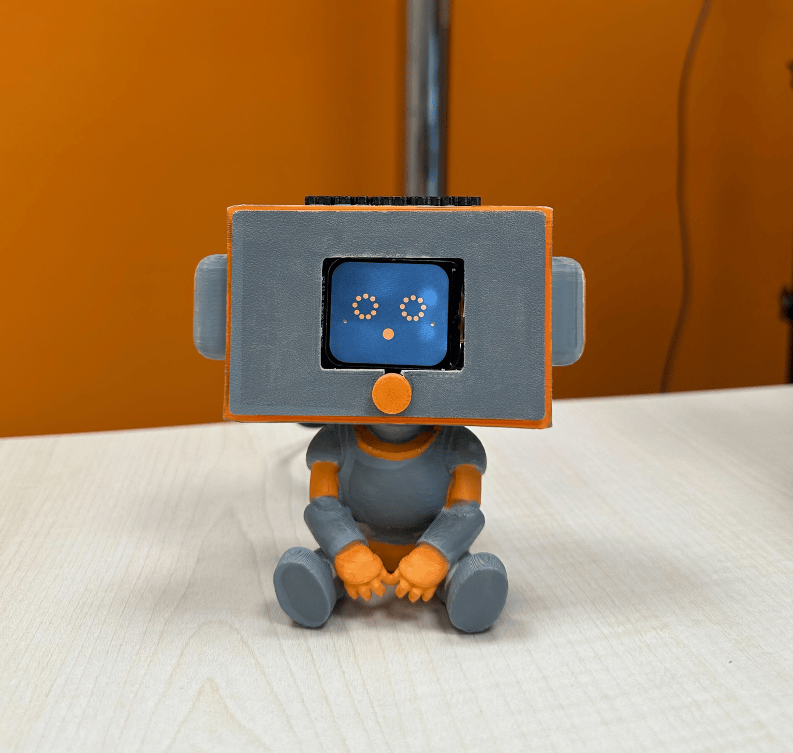
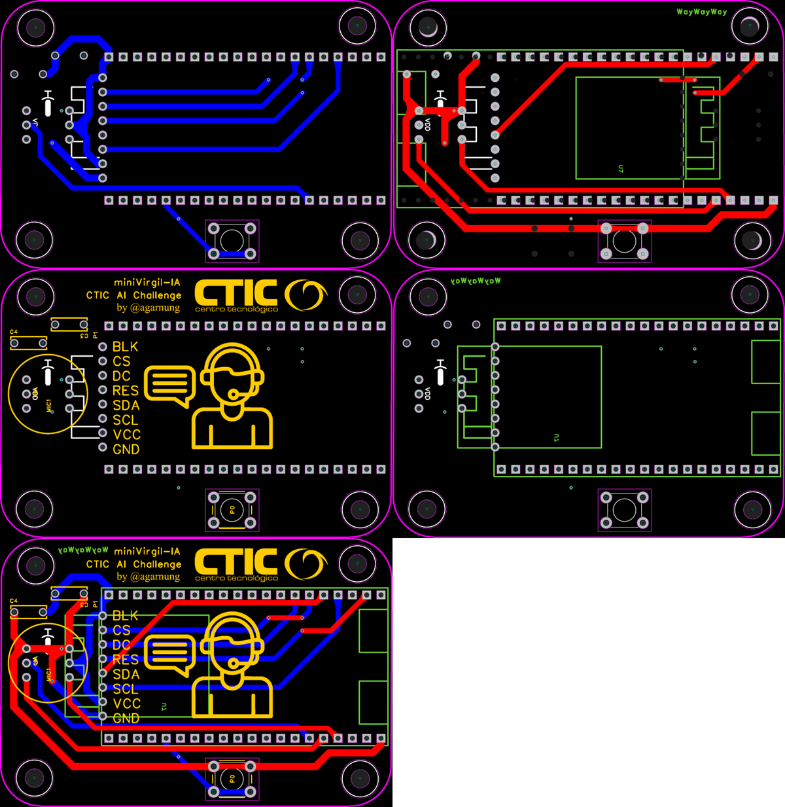

# miniVirgil

Physical voice device to interact with the Virgil assistant using a button and a microphone. Based on the ESP32-S3, it captures real-time PCM audio and streams it over WebSocket to the Virgil-IA backend, which returns the response generated by the LLM.



---

## GenAI Features

miniVirgil is the hardware endpoint of the conversational voice AI pipeline; all intelligence lives in the connected Virgil-IA backend.

### Standalone miniVirgil

| # | Feature | Description |
|---|---------|-------------|
| 1 | **Embedded voice interface (push-to-talk)** | A physical button opens the I2S microphone (INMP441); the ESP32 accumulates 16 kHz PCM audio in PSRAM and sends it as binary data over WebSocket to the `/ws/chat-audio` endpoint when the button is released. The backend applies STT → LLM → TTS and returns the response as audio. |
| 2 | **Raw audio transport to the backend** | PCM is sent uncompressed and without local processing, eliminating encoding latency and any dependency on AI libraries running on the microcontroller. |
| 3 | **AI state visual feedback** | The TFT display (ST7789, 240×280) shows bitmap images indicating the state of the cycle: *Waiting → Recording → Processing → Sending*, closing the user feedback loop during remote inference. |

### In the full ecosystem

Combined with Virgil-IA and the rest of the framework components, miniVirgil enables:

| Joint feature | Description |
|---------------|-------------|
| **End-to-end voice pipeline on embedded hardware** | Audio captured by the ESP32 traverses the complete backend pipeline: STT (ElevenLabs Scribe / local OpenAI) → LLM (Qwen) with RAG and tool calling → TTS (Qwen TTS or ElevenLabs). Employees can complete onboarding itinerary tasks using only their voice, with no screen or keyboard required. |
| **Physical assistant node in the workspace** | miniVirgil can be placed on an employee's desk or in a common area as an instant access point to the assistant, complementing the web chat, Android app, and touch kiosk. |

---

## Hardware

| Component | Model | Function |
|-----------|-------|----------|
| Microcontroller | ESP32-S3 N16R8 | CPU + WiFi + 8 MB PSRAM + 16 MB Flash |
| Microphone | INMP441 (I2S) | Voice capture at 16 kHz, left channel |
| Display | ST7789V2 240×280 | Visual state feedback |
| Button | External push button (GPIO 42) | Push-to-talk activation |

The full electronic design (schematic, PCB, BOM) is available in [`electronic_design/`](./electronic_design/).

### PCB Design

The rendered PCB views below were extracted from [`electronic_design/PCB.pdf`](./electronic_design/PCB.pdf) and saved as PNG images in [`electronic_design/`](./electronic_design/).



Individual PCB views: [view 1](./electronic_design/PCB_view_1.png) · [view 2](./electronic_design/PCB_view_2.png) · [view 3](./electronic_design/PCB_view_3.png) · [view 4](./electronic_design/PCB_view_4.png) · [view 5](./electronic_design/PCB_view_5.png)

> [!IMPORTANT]
>
> Huge thanks to **[PCBWay](https://www.pcbway.com/)** for manufacturing these boards. The silkscreen printing is precise and clear, and the board surface is well-finished, making it very easy to clean with isopropyl alcohol.
>
> If you want to order with them: their **prices** and **turnaround** are excellent — check them out at [pcbway.com](https://www.pcbway.com/).

Boards from PCBWay:


---

## Firmware

The firmware (Arduino IDE) is located in [`firmware/main.ino`](./firmware/main.ino).

### Initial configuration (in the sketch)

```cpp
const char* ssid     = "your_wifi_network";
const char* password = "your_password";
const char* ws_host  = "IP_of_Virgil_backend";
const int   ws_port  = 8000;  // or the port exposed in docker-compose
const char* endpoint = "/ws/chat-audio?user_id=employee_UUID";
```

### Dependencies (Arduino IDE — Library Manager)

- Adafruit ST7789
- Adafruit GFX Library
- Adafruit BusIO
- WebSocketsClient (Markus Sattler)

### Board configuration (Arduino IDE)

| Parameter | Value |
|-----------|-------|
| Board | ESP32S3 Dev Module |
| CPU Frequency | 240 MHz (WiFi/BT) |
| Flash Size | 16 MB |
| Partition Scheme | Huge APP (3 MB No OTA / 1 MB SPIFFS) |
| PSRAM | OPI PSRAM (Enabled) |
| USB CDC On Boot | Disabled |

### Status images

The on-screen images are converted to C arrays using the included script:

```bash
python firmware/image_to_RGB565_bitmap.py assets/grabando.png
```

This generates the corresponding `.h` file to include in the sketch.

---

## Life-cycle states

```
[STARTING] → WiFi + WebSocket
[CONNECTED / DISCONNECTED] → Waiting for button press
[RECORDING…] → Button pressed, accumulating PCM in PSRAM
[PROCESSING] → Button released
[SENDING…] → Data sent over WebSocket
[CONNECTED] → Waiting for the next interaction
```

---

## Roadmap / Future improvements

- **TTS audio playback / talking cyborg**: stream the synthesized response back to the ESP32 and play it through an I2S speaker (MAX98357A or similar), closing the bidirectional voice loop without relying on another device.
- **Wake-word activation**: replace the button with on-device wake-word detection (e.g., "Hey Virgil") using a lightweight model running on the ESP32.
- **Status LED indicator**: add an RGB LED strip or a single RGBA diode for state feedback without depending on the display.
- **OTA (Over-the-Air) updates**: remote firmware updates via HTTPS for deployments across multiple devices without physical access (e.g., flashing firmware over FTDI).
- **Offline mode (BLE)**: Bluetooth Low Energy connectivity alternative for environments with restricted corporate networks.
